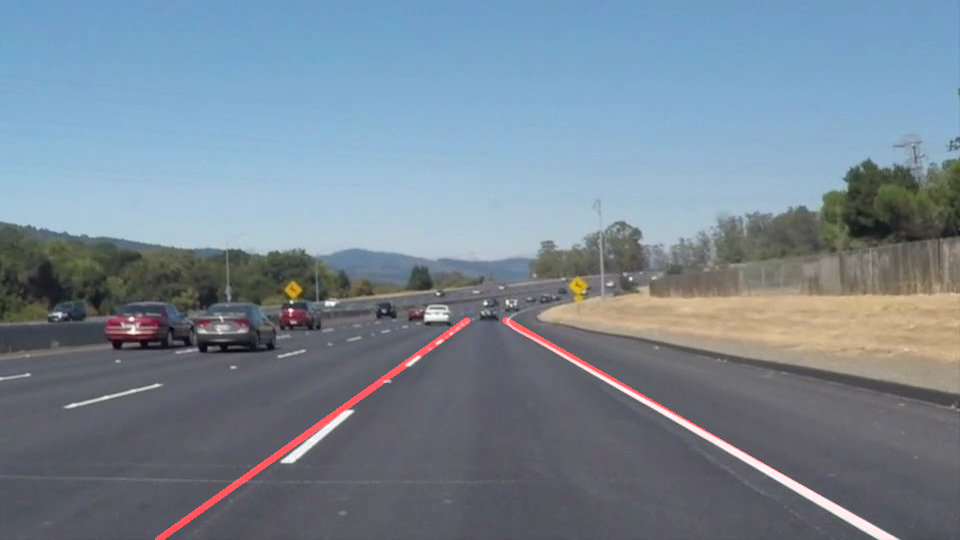

# **Finding Lane Lines on the Road** 

## Writeup 
---

**Finding Lane Lines on the Road**

The goals / steps of this project are the following:
* To ake a pipeline that finds lane lines on the road
* To reflect on the work in a written report

[image1]: (./examples/grayscale.jpg) "Grayscale"

---

### Reflection

### 1. Describe your pipeline. As part of the description, explain how you modified the draw_lines() function.

My pipeline consisted of 5 steps. First, I converted the images to grayscale, then I applied a Gaussian Blur with a kernel size of 5. Then, canny edge detector was used to find the edges in the image with threshold values of 50 and 150. Then a region of interest was masked to focus the detection on a particular region. A quadrilateral with bottom vertices being the bottom vertices of the image and the top vertices being two points approximately near the end of the lanes. The, hough lines transform was used to draw line segments in the image. A minimum length of 25 was set so that the lane markings are present. A single line is required to be drawn as a requirement of this project. Each line segment was interpolated to y values of 320 and the bottom of the image and the respective x values were obtained. The slopes of the line segments werenused to classify between the ones on the left and the ones on the right. The ones on the left have negative slopes and the ones on the right have positive slopes. The interpolation values on the top and bottom of both the boundaries of the lane are obtained. Now two lines are drawn by joining those points

### 2. Identify potential shortcomings with your current pipeline

The region of interest assumed in this pipeline may not always hold true. As experimented with the challenge video, the apparent meeting point of the two lanes might happen at a shorter distance. So the draw lines function fails due to the assumption of an interpolation till a y value of 320. It is tough to detect curved lanes due to many reasons. But one of them is the assumption in the pipeline that the slopes of the two boundary lines have opposite signs. Also presence of a strong boundary along the edge of the road might shift the detected lines towards the edge of the road and might fail to detect the edge of the lane. Another potential shortcoming would be what would happen when there is a brightness in the image.

### 3. Suggest possible improvements to your pipeline

A possible improvement would be to adjust the top end of both the lane boundaries according to the lane's end point. Another could be to find the presence of curves by setting a dynamic slope seperator i.e some number other than zero shall differentiate between left and right edge during the presence of curves. The perspective transform and other methods used in the next chapter could be used to search for the lanes better.