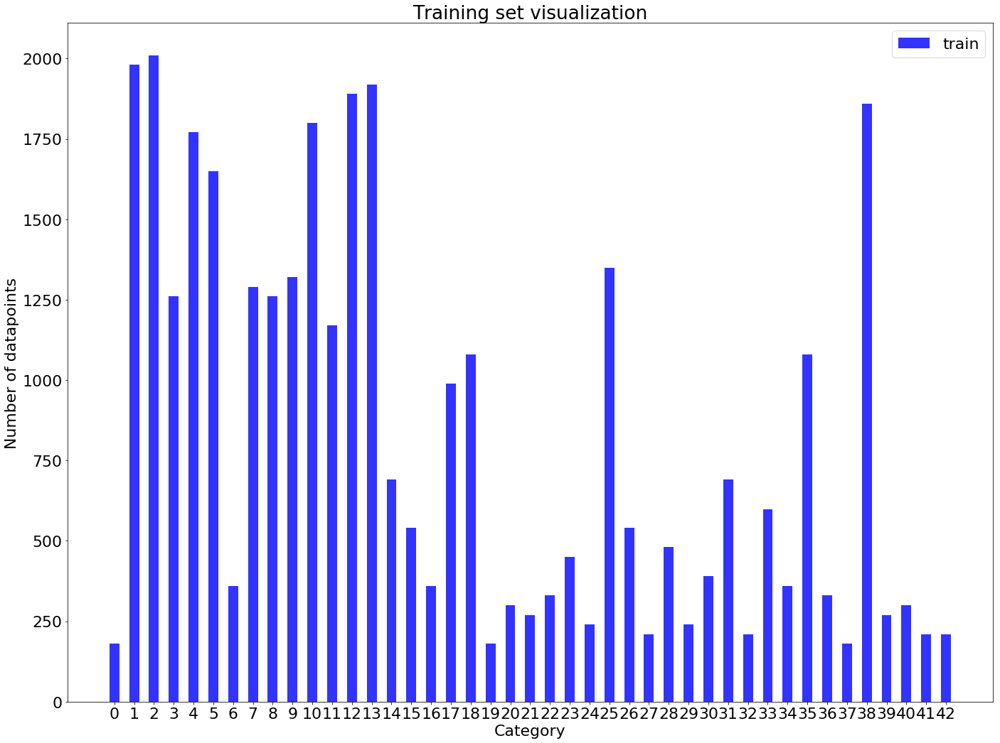
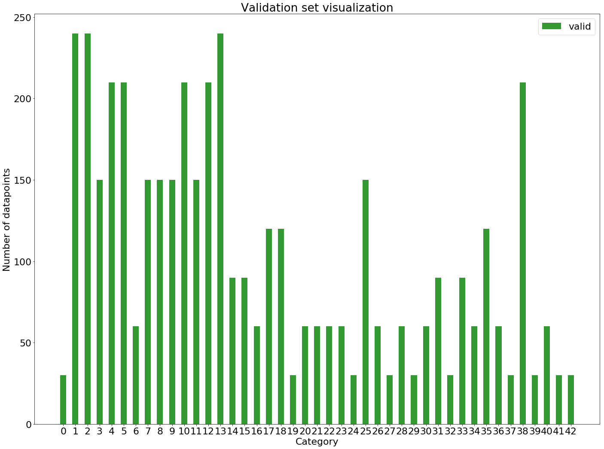
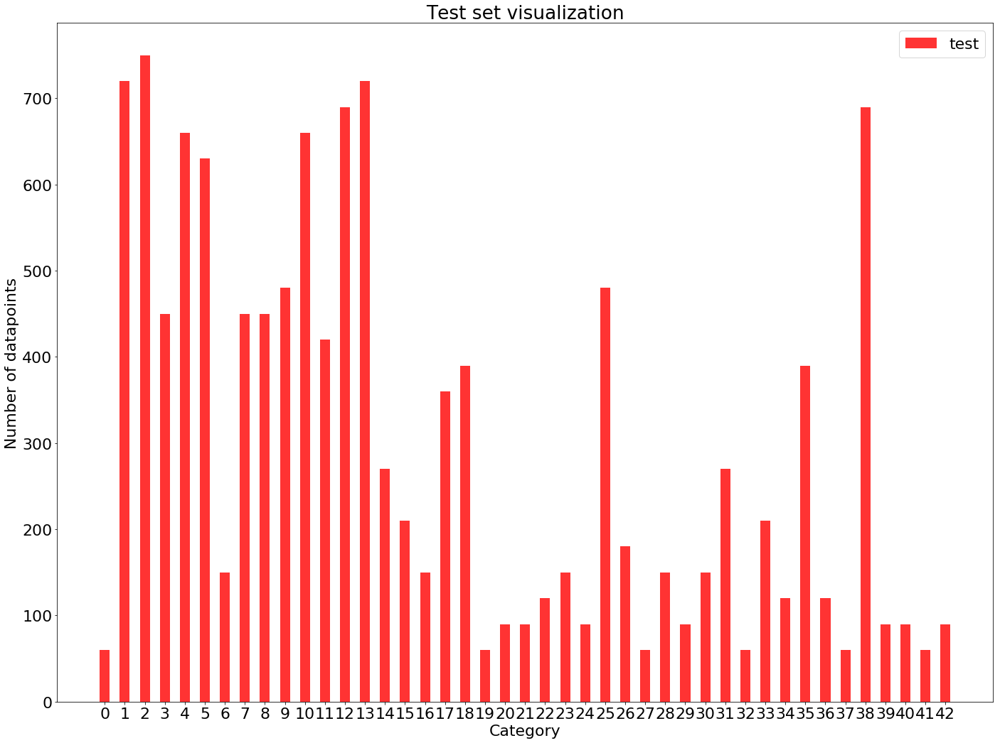
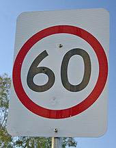
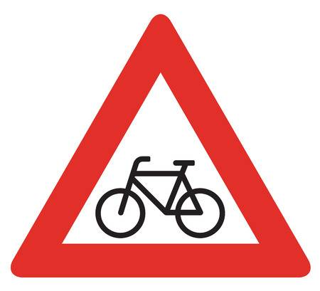
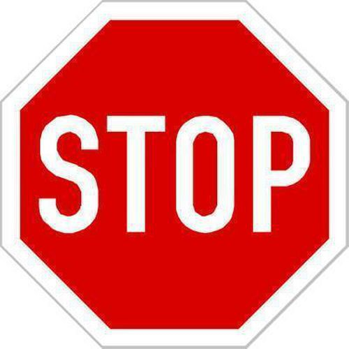

## Project: Build a Traffic Sign Recognition Program

Overview
---
In this project, traffic signs are classified by training and validating a model using the [German Traffic Sign Dataset](http://benchmark.ini.rub.de/?section=gtsrb&subsection=dataset). After the model is trained, German traffic signs that are found on the web are classified using the model

The Project
---
The goals / steps of this project are the following:
* Load the data set
* Explore, summarize and visualize the data set
* Design, train and test a model architecture
* Use the model to make predictions on new images
* Analyze the softmax probabilities of the new images

## Rubric Points
### Here I will consider the [rubric points](https://review.udacity.com/#!/rubrics/481/view) individually and describe how I addressed each point in my implementation.  

---

### Data Set Summary & Exploration

#### 1. Provide a basic summary of the data set. In the code, the analysis should be done using python, numpy and/or pandas methods rather than hardcoding results manually.

The function unique() found in numpy library was used to calculate the size of the three sets. The sizes of Training, Validation and Test sets were 34799, 4410, 12630 respectively from 43 different categories of traffic signs. Each image was 32px by 32px.

#### 2. Include an exploratory visualization of the dataset.

Here is a bar chart of the training data set

Here is a bar chart of the validation data set

Here is a bar chart of the test data set

### Design and Test a Model Architecture

#### 1. Describe how you preprocessed the image data. What techniques were chosen and why did you choose these techniques? Consider including images showing the output of each preprocessing technique. Pre-processing refers to techniques such as converting to grayscale, normalization, etc. (OPTIONAL: As described in the "Stand Out Suggestions" part of the rubric, if you generated additional data for training, describe why you decided to generate additional data, how you generated the data, and provide example images of the additional data. Then describe the characteristics of the augmented training set like number of images in the set, number of images for each class, etc.)

As a first step, I decided to convert the images to grayscale. Then the images were normalized for every value to lie between -1 and 1.

I decided to generate additional data because the test accuracy values were really low and amount of data provided is low. After data augmentation, the number of images in each category was 2500 which was almost thrice the original size. The data augmentation was performed using various image processing techniques. The techniques used were median blurring, Gaussian blurring, Histogram Equalization (CLAHE), Brightness modification, random rotation of upto 15 degrees in either direction and translation of upto 5 pixels on either sides.

The difference between the original data set and the augmented data set is the following ... 

#### 2. Describe what your final model architecture looks like including model type, layers, layer sizes, connectivity, etc.) Consider including a diagram and/or table describing the final model.

LeNet architecture was chosen and a few modifications were made:
* Since LeNet was developed for Character recognition which is almost similar to a traffic sign classification problem, the same architecture was chosen with a few modifications
* Another fully connected layer with RELU was added and dropout was introduced in both the layers to prevent overfitting
* An extra fully connected layer was added and it was observed to perform better.
* Adam optimizer was chosen as it performed better in previous experiences (including behavioral cloning project). The Stochastic Gradient descent is believed to improve slower than the Adam optimizer

My final model consisted of the following layers:

| Layer         		|     Description	        					| 
|:---------------------:|:---------------------------------------------:| 
| Input         		| 32x32x3 RGB image   							| 
| Convolution 5x5     	| 1x1 stride, valid padding, outputs 28x28x16 	|
| RELU					|												|
| Max pooling	      	| 2x2 stride,  outputs 14x14x16 				|
| Convolution 5x5     	| 1x1 stride, valid padding, outputs 10x10x64 	|
| RELU					|												|
| Max pooling	      	| 2x2 stride,  outputs 5x5x64 				    |
| Flatten	            | outputs 1600    								|
| Fully connected		| outputs 400        							|
| RELU  				|         									    |
| Random Dropout        | 										    	|
| Fully connected		| outputs 200        							|
| RELU  				|         									    |
| Random Dropout        | 										    	|
| Fully connected		| outputs 43									|

#### 3. Describe how you trained your model. The discussion can include the type of optimizer, the batch size, number of epochs and any hyperparameters such as learning rate.

To train the model, I used an Adam optimizer with a tunable learning rate which was set to 0.001. The number of epochs was 50 initially and it was still improving. Each run of the experiment had a different stopping point for improvement. So a safer higher epoch value of 100 was set. The batch size was set to 256 because the accuracy was almost similar to when it was set to 64 and 128 after a few epochs. The weights were initialized from a truncated normal distribution with mean 0 and a standard deviation of 0.06. Those values were chosen by testing the accuracy by changing both the values. The model improves much faster when these two values were used. 

#### 4. Describe the approach taken for finding a solution and getting the validation set accuracy to be at least 0.93. Include in the discussion the results on the training, validation and test sets and where in the code these were calculated. Your approach may have been an iterative process, in which case, outline the steps you took to get to the final solution and why you chose those steps. Perhaps your solution involved an already well known implementation or architecture. In this case, discuss why you think the architecture is suitable for the current problem.

My final model results were:
* training set accuracy of 99.2%
* validation set accuracy of 96.9%
* test set accuracy of 94.9%

LeNet architecture was chosen and a few modifications were made:
* Since LeNet was developed for Character recognition which is almost similar to a traffic sign classification problem, the same architecture was chosen with a few modifications
* Another fully connected layer with RELU was added and dropout was introduced in both the layers to prevent overfitting
* Adam optimizer was chosen as it performed better in previous experiences (including behavioral cloning project). The Stochastic Gradient descent is believed to improve slower than the Adam optimizer
* The parameter tuning started with changing mean and standard deviation of the normal distribution from where the values of weights are chosen. Then learning rate, batch size and epochs are tuned in the same order. Then dropouts were introduced and a significant improvement was observed
 

### Test a Model on New Images

#### 1. Choose five German traffic signs found on the web and provide them in the report. For each image, discuss what quality or qualities might be difficult to classify.

Here are five German traffic signs that I found on the web:

The first image might be difficult to classify because of its similarity with 80 and its not a classifier focussed on numbers. So distinctive features of each number were not taken into account unlike a number classifier. After running it on more epochs, this problem got resolved. The second image gave its result as a bumpy road a few times.

#### 2. Discuss the model's predictions on these new traffic signs and compare the results to predicting on the test set. At a minimum, discuss what the predictions were, the accuracy on these new predictions, and compare the accuracy to the accuracy on the test set (OPTIONAL: Discuss the results in more detail as described in the "Stand Out Suggestions" part of the rubric).

Here are the results of the prediction:

| Image			        |     Prediction	        					| 
|:---------------------:|:---------------------------------------------:| 
| 60 km/h    		    | 60 km/h   									| 
| Bicycle Crossing 	    | Bicycle Crossing 							    |
| Road work				| Road work										|
| Slippery Road	      	| Slippery Road					 				|
| Stop sign			    | Stop sign      							    |

The model was able to correctly guess 5 of the 5 traffic signs, which gives an accuracy of 100%. This compares favorably to the accuracy on the test set of 94.9%

#### 3. Describe how certain the model is when predicting on each of the five new images by looking at the softmax probabilities for each prediction. Provide the top 5 softmax probabilities for each image along with the sign type of each probability. 

The code for making predictions on my final model is located in the cells 13-17 of the Ipython notebook.

For the first image, the model is very sure that the sign is a speed limit of 60 Kmph (probability of 1.0), and the image does contain a 60 Kmph speed limit. The top five soft max probabilities were (The other probabilities were less than 0.001. So they aren't listed here. The top 5 probabilities all have number related signs 

| Probability         	|     Prediction	        					    | 
|:---------------------:|:-------------------------------------------------:| 
| 1         			| Speed limit 60 Kmph   						    | 
| <0.001     			| End of Speed Limit 80 kmph 					    |
| <0.001				| Speed Limit 80 kmph							    |
| <0.001	      		| End of no passing by vehicles over 3.5 metric tons|
| <0.001				| Speed Limit 30 Kmph       						|

For the second image, the model is almost sure with a probability of 0.868 with a bumpy road being predicted with a probability of 0.132. The other probabilities were almost zero with the order being Children crossing, Dangerous curve to the right and slippery road. In many other runs, the bumpy road sign was the one that was actually predicted.
| Probability         	|     Prediction	        					    | 
|:---------------------:|:-------------------------------------------------:| 
| 0.868         			| Bicycles Crossing   						    | 
| 0.132     			| Bumpy Road 					    |
| <0.001				| Children Crossing							    |
| <0.001	      		| Dangerous curve to the right|
| <0.001				| Slippery Road       						|

The last three signs encountered precise and accurate predictions with the probabilities of predictions being almost equal to 1.
Predictions for third image
| Probability         	|     Prediction	        					    | 
|:---------------------:|:-------------------------------------------------:| 
| 1.000         			| Road work   						    | 
| <0.001     			| Bumpy Road 					    |
| <0.001				| Slippery Road							    |
| <0.001	      		| Dangerous curve to the right|
| <0.001				| Wild animals crossing       						|

Predictions for fourth image
| Probability         	|     Prediction	        					    | 
|:---------------------:|:-------------------------------------------------:| 
| 1.000         			| Slippery Road   						    | 
| <0.001     			| Bicycles Crossing 					    |
| <0.001				| Wild animals Crossing							    |
| <0.001	      		| Road narrows down on the right|
| <0.001				| Bumpy Road       						|

Predictions for fifth image
| Probability         	|     Prediction	        					    | 
|:---------------------:|:-------------------------------------------------:| 
| 1.000         			| Stop   						    | 
| <0.001     			| No vehicles 					    |
| <0.001				| speed limit - 60 km/h							    |
| <0.001	      		| speed limit - 120 km/h|
| <0.001				| Bicycles crossing       						|
