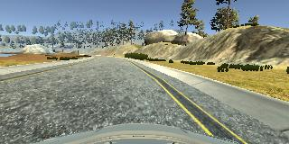
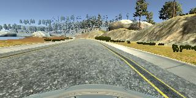
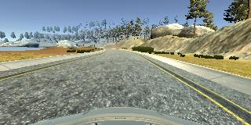

# **Behavioral Cloning** 

---

**Behavioral Cloning Project**

The goals / steps of this project are the following:
* Use the simulator to collect data of good driving behavior
* Build, a convolution neural network in Keras that predicts steering angles from images
* Train and validate the model with a training and validation set
* Test that the model successfully drives around track one without leaving the road
* Summarize the results with a written report


[//]: # (Image References)

[image1]: ./examples/placeholder.png "Model Visualization"
[image2]: ./examples/placeholder.png "Grayscaling"
[image3]: ./examples/placeholder_small.png "Recovery Image"
[image4]: ./examples/placeholder_small.png "Recovery Image"
[image5]: ./examples/placeholder_small.png "Recovery Image"
[image6]: ./examples/placeholder_small.png "Normal Image"
[image7]: ./examples/placeholder_small.png "Flipped Image"

## Rubric Points
### Here I will consider the [rubric points](https://review.udacity.com/#!/rubrics/432/view) individually and describe how I addressed each point in my implementation.  

---
### Files Submitted & Code Quality

#### 1. Submission includes all required files and can be used to run the simulator in autonomous mode

My project includes the following files:
* model.py containing the script to create and train the model
* drive.py for driving the car in autonomous mode
* model.h5 containing a trained convolution neural network 
* writeup_report.md or writeup_report.pdf summarizing the results

#### 2. Submission includes functional code
Using the Udacity provided simulator and my drive.py file, the car can be driven autonomously around the track by executing 
```sh
python drive.py model.h5
```

#### 3. Submission code is usable and readable

The model.py file contains the code for training and saving the convolution neural network. The file shows the pipeline I used for training and validating the model, and it contains comments to explain how the code works.

### Model Architecture and Training

#### 1. An appropriate model architecture has been employed with appropriate data augmentation
The architecture is similar to NVIDIA architecture. It starts with convolutional layers that have 5x5 filters with depths of 24, 36 and 48 respectively in the first 3 layers and a stride of 2 in both the directions. These layers are followed by two convolutional layers each having 3x3 filters of depth 64 with strides of 1 in both the directions. Exponential Linear Unit activation function is used in all the five convolutional layers. A maxpooling layer follows. The layer is flattened and fed into four fully connected layers with first two having ELU activation. (model.py lines 134 to 147). The model includes ELU layers to introduce nonlinearity, and the data is normalized in the model using a Keras lambda layer (code line 125). 

The final step was to run the simulator to see how well the car was driving around track one. For the initial few times, the car fell off the track due to the main reason of not feeding in proper data. With proper recovery laps and bias reduction by removing too continuous straight driving data, the model was finally able to perform better. Following is an example of a recovery lap





At the end of the process, the vehicle is able to drive autonomously around the track without leaving the road.

#### 2. Attempts to reduce overfitting in the model

The model contains dropout layers in order to reduce overfitting (model.py lines 142, 144, 146). 

The model was trained and validated on different data sets and augmented using techniques like histogram equalization, brightness modification and image flipping to ensure that the model was not overfitting (code line 97-115). The data collection was performed using the simulator on track 1 with three normal laps properly aligned at the centre each on both the directions and one recovery lap in each direction, so that the vehicle learns how to recover when it loses track and another equal amount of random driving in both the directions. Two log files were created because of running the vehicle at two different points of time. The model was tested by running it through the simulator and ensuring that the vehicle could stay on the track.

#### 3. Model parameter tuning

The model used an adam optimizer, with a tunable learning rate which was set to 0.001 (model.py line 156, 158).

#### 4. Appropriate training data

Training data was chosen to keep the vehicle driving on the road. I used a combination of center lane driving, recovering from the left and right sides of the road

I had around 42000 training data and 14000 validation data and the validation loss started getting constant after the third epoch.
