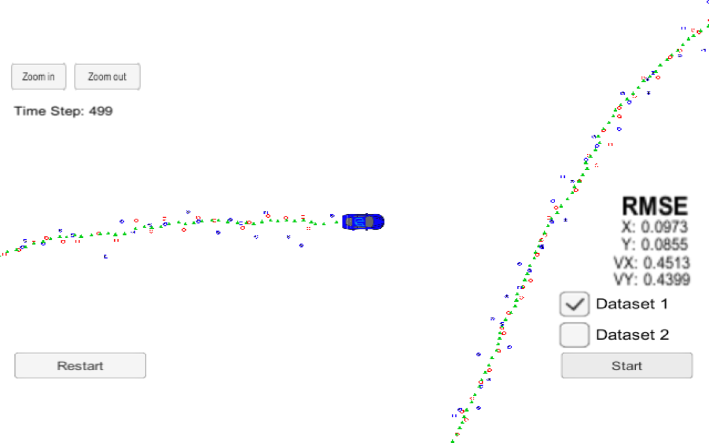

# Extended Kalman Filter Project

In this project a kalman filter is utilized to estimate the state of a moving object of interest with noisy lidar and radar measurements. The install file viz., install-mac.sh or install-ubuntu.sh is run to install the required dependencies.
This project involves the Simulator which can be downloaded [here](https://github.com/udacity/self-driving-car-sim/releases)
Once the install for uWebSocketIO is complete, the main program can be built and run by doing the following from the project top directory. A build directory with a compiled file 'ExtendedKF' is available in this repository.

1. mkdir build
2. cd build
3. cmake ..
4. make
5. ./ExtendedKF

Here is the main protcol that main.cpp uses for uWebSocketIO in communicating with the simulator.

INPUT: values provided by the simulator to the c++ program

["sensor_measurement"] => the measurement that the simulator observed (either lidar or radar)

OUTPUT: values provided by the c++ program to the simulator

["estimate_x"] <= kalman filter estimated position x
["estimate_y"] <= kalman filter estimated position y
["rmse_x"]
["rmse_y"]
["rmse_vx"]
["rmse_vy"]

The following image shows the final rmse values of x, y, vx, vy

---

## Other Important Dependencies

* cmake >= 3.5
  * All OSes: [click here for installation instructions](https://cmake.org/install/)
* make >= 4.1 (Linux, Mac), 3.81 (Windows)
  * Linux: make is installed by default on most Linux distros
  * Mac: [install Xcode command line tools to get make](https://developer.apple.com/xcode/features/)
  * Windows: [Click here for installation instructions](http://gnuwin32.sourceforge.net/packages/make.htm)
* gcc/g++ >= 5.4
  * Linux: gcc / g++ is installed by default on most Linux distros
  * Mac: same deal as make - [install Xcode command line tools](https://developer.apple.com/xcode/features/)
  * Windows: recommend using [MinGW](http://www.mingw.org/)

## Basic Build Instructions

1. Clone this repo.
2. Move to build directory `cd build`
3. Run the compiled file: `./ExtendedKF `

