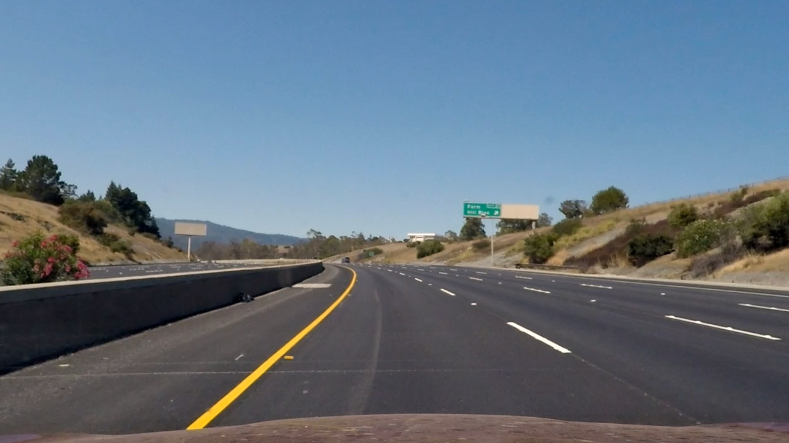
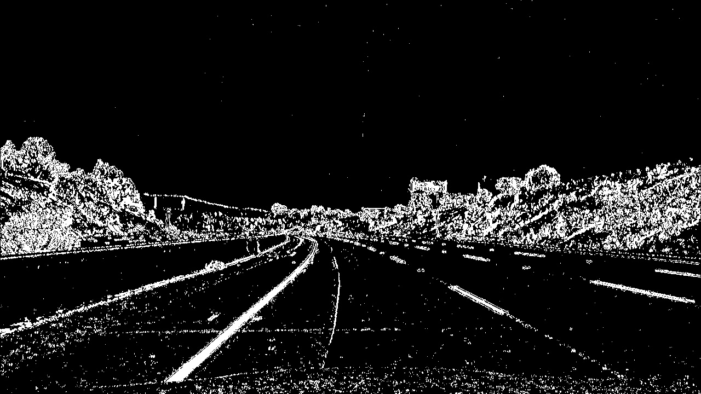
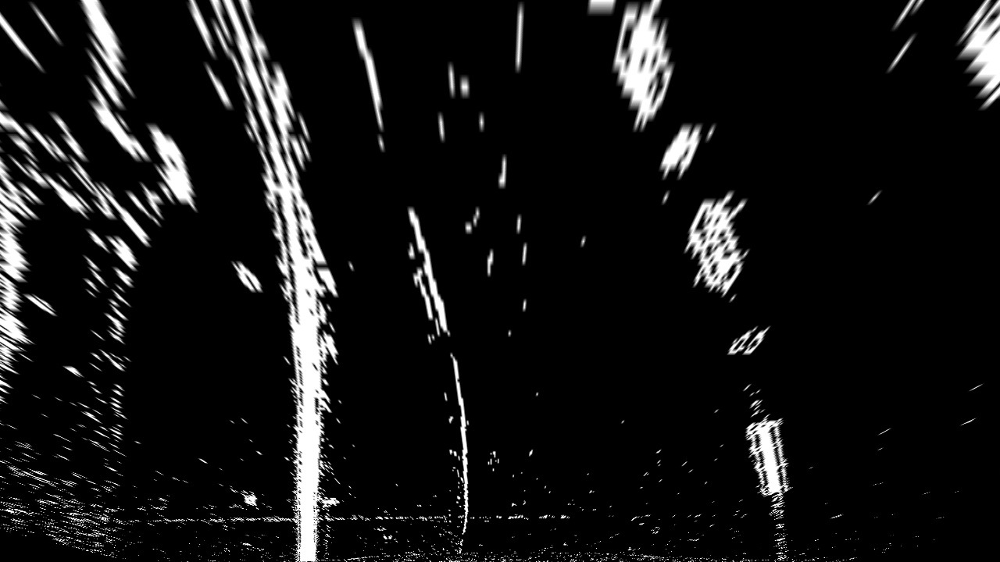
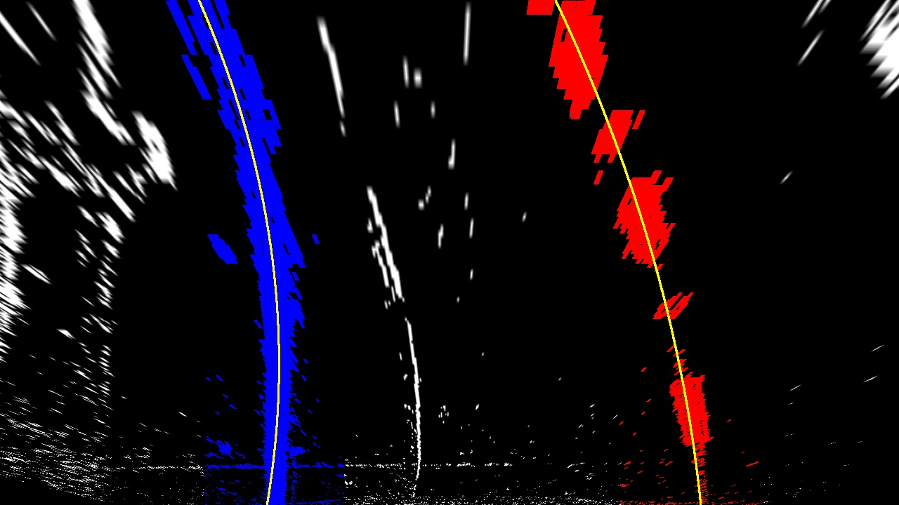
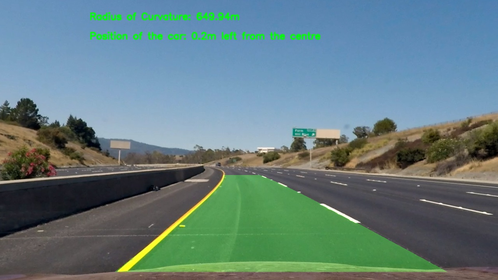

## Writeup


---

**Advanced Lane Finding Project**

The goals / steps of this project are the following:

* Compute the camera calibration matrix and distortion coefficients given a set of chessboard images.
* Apply a distortion correction to raw images.
* Use color transforms, gradients, etc., to create a thresholded binary image.
* Apply a perspective transform to rectify binary image ("birds-eye view").
* Detect lane pixels and fit to find the lane boundary.
* Determine the curvature of the lane and vehicle position with respect to center.
* Warp the detected lane boundaries back onto the original image.
* Output visual display of the lane boundaries and numerical estimation of lane curvature and vehicle position.

[//]: # (Image References)

## [Rubric](https://review.udacity.com/#!/rubrics/571/view) Points

### Here I will consider the rubric points individually and describe how I addressed each point in my implementation.  

---

### Writeup / README


The code begins with all the libraries being imported. Then all the required functions are declared and at the end, the functions are called to obtain the results.

### Camera Calibration

#### 1. Briefly state how you computed the camera matrix and distortion coefficients. Provide an example of a distortion corrected calibration image.
 
The code for this step is contained in lines 24-38 of lane_finding_2.py

I start by preparing "object points", which will be the (x, y, z) coordinates of the chessboard corners in the world. Here I am assuming the chessboard is fixed on the (x, y) plane at z=0, such that the object points are the same for each calibration image.  Thus, `objp` is just a replicated array of coordinates, and `objpoints` will be appended with a copy of it every time I successfully detect all chessboard corners in a test image.  `imgpoints` will be appended with the (x, y) pixel position of each of the corners in the image plane with each successful chessboard detection. The given chessboard images were 9x6 chess boards. 17 out of the 20 calibration images used from the folder camera_cal had their corners detected and the respective imagepoints were found. The remaining 3 images didn't have some corners within the image range and hence failed in corner detection.

I then used the output `objpoints` and `imgpoints` to compute the camera calibration and distortion coefficients using the `cv2.calibrateCamera()` function.  I applied this distortion correction to the test image using the `cv2.undistort()` function and obtained this result: 


### Pipeline (single images)

The distortion matrix obtained was used to unwarp one of the test images as below



Then, I used a combination of color and gradient thresholds to generate a binary image (thresholding steps at lines #45 through #74 in `proj2.py`).  Here's an example of my output for this step.



The code for my perspective transform includes a function called `unwarp_image()`, which appears in lines 76 through 88 in the code.  The `warper()` function takes as inputs an image (`img`), as well as source (`src`) and destination (`dst`) points.  I chose to hardcode the source and destination points in the following manner:

```python
src = np.float32([[img.shape[1]/2-60,img.shape[0]/2+90],[img.shape[1]/2+60,img.shape[0]/2+90],[(img.shape[1]*3/4)+140,img.shape[0]-20],[img.shape[1]/4-110,img.shape[0]-20]])
dst = np.float32([[img.shape[1]/4,0],[img.shape[1]*3/4,0],[img.shape[1]*3/4,img.shape[0]],[img.shape[1]/4,img.shape[0]]])

```

This resulted in the following source and destination points:

| Source        | Destination   | 
|:-------------:|:-------------:| 
| 580, 450      | 320, 0        | 
| 700, 450      | 960, 0      |
| 1100, 700     | 960, 720      |
| 210, 700      | 320, 720        |

I verified that my perspective transform was working as expected by drawing the `src` and `dst` points onto a test image and its warped counterpart to verify that the lines appear parallel in the warped image.




Window search was performed to obtain the lane pixels. Then polyfit function helped in obtaining the second order equation of the the two curves like the following image. The functions are found from lines 90 through 180. The window search is restricted near the initially found curve after the first frame is processed and the function search_around_poly found from lines 180 through 242 performs this


The radii of curvature of the two curves are calculated using the given formula and they are converted from pixels to metres by approximate measurements. The average of the two radii is assumed as the radius of the curve. The midpoint of the bottom of the two edges is obtained and the distance of it from the midpoint of the frame is the distance of the car from the centre of the lane. lines 302-313

The inverse perspective transform is performed and the image is brought back to the normal view. The corresponding function is found in the lines 315 to 330



---

### Pipeline (video)

#### 1. Provide a link to your final video output.  Your pipeline should perform reasonably well on the entire project video (wobbly lines are ok but no catastrophic failures that would cause the car to drive off the road!).

Here's a [link to my video result](output.mp4)

---

### Discussion

Though the project is more robust than the previous one, it fails under a few conditions. When the brightness increases, the detected region wobbles around. The presence of a thick crack on the lane might result in wrong predictions as seen in a challenge video. The presence of bikes and sharp curves lead to further wrong predictions.

